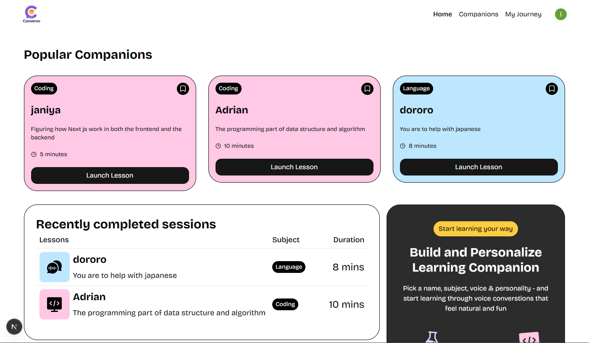

# Converso - AI Teaching Platform 🎓

 <!-- Replace with your image path -->

## 📋 Table of Contents
- [Overview](#overview)
- [Features](#features)
- [Tech Stack](#tech-stack)
- [Prerequisites](#prerequisites)
- [Installation](#installation)
- [Environment Variables](#environment-variables)
- [Database Setup](#database-setup)
- [Usage](#usage)
- [Project Structure](#project-structure)
- [API Routes](#api-routes)
- [Contributing](#contributing)
- [License](#license)

## 🌟 Overview

Converso is a cutting-edge real-time AI teaching platform that enables students to have natural voice conversations with AI companions for personalized learning experiences. Built with Next.js 14, it features dynamic companion creation, voice-powered interactions, and comprehensive session management.

### ✨ Key Highlights
- **Voice-First Learning**: Natural voice conversations with AI tutors
- **Custom AI Companions**: Create personalized learning assistants
- **Real-time Interactions**: Powered by Vapi AI for seamless voice communication
- **Multi-Subject Support**: Math, Science, Language, History, Coding, Economics
- **Session Management**: Track learning progress and session history

## 🚀 Features

### 🎯 Core Features
- **AI Companion Builder**: Create custom tutors with specific subjects, topics, voices, and teaching styles
- **Voice Conversations**: Real-time voice interaction using advanced speech recognition
- **Subject-Specific Learning**: Specialized companions for different academic subjects
- **Session Tracking**: Comprehensive history of learning sessions
- **User Authentication**: Secure authentication with Clerk
- **Responsive Design**: Optimized for desktop and mobile devices

### 🛠 Advanced Features
- **Dynamic Voice Selection**: Choose between male/female voices with formal/casual styles
- **Real-time Transcription**: Live transcription of conversations
- **Bookmark System**: Save favorite companions for quick access
- **Search & Filter**: Find companions by subject or topic
- **Error Monitoring**: Integrated Sentry for error tracking
- **Subscription Management**: Premium features with Clerk subscriptions

## 🛡️ Tech Stack

### Frontend
- **Framework**: Next.js 14 (App Router)
- **Language**: TypeScript
- **Styling**: Tailwind CSS + Custom CSS
- **UI Components**: Radix UI
- **Animations**: Lottie React
- **Forms**: React Hook Form + Zod validation

### Backend & Services
- **Database**: Supabase (PostgreSQL)
- **Authentication**: Clerk
- **Voice AI**: Vapi AI
- **Error Tracking**: Sentry
- **Deployment**: Vercel (recommended)

### Development Tools
- **Package Manager**: npm/yarn
- **Code Quality**: ESLint, TypeScript
- **Version Control**: Git

## 📋 Prerequisites

Before running this project, ensure you have:

- **Node.js** (v18 or higher)
- **npm** or **yarn**
- **Supabase account** (for database)
- **Clerk account** (for authentication)
- **Vapi AI account** (for voice interactions)
- **Sentry account** (for error monitoring)

## 🚀 Installation

1. **Clone the repository**
   ```bash
   git clone https://github.com/yourusername/converso.git
   cd converso
   ```

2. **Install dependencies**
   ```bash
   npm install
   # or
   yarn install
   ```

3. **Set up environment variables**
   ```bash
   cp .env.example .env.local
   ```

4. **Configure your environment variables** (see section below)

5. **Run the development server**
   ```bash
   npm run dev
   # or
   yarn dev
   ```

6. **Open your browser**
   Navigate to [http://localhost:3000](http://localhost:3000)

## 🔧 Environment Variables

Create a `.env.local` file in the root directory with the following variables:

```env
# Clerk Authentication
NEXT_PUBLIC_CLERK_PUBLISHABLE_KEY=pk_test_your_key_here
CLERK_SECRET_KEY=sk_test_your_secret_here
NEXT_PUBLIC_CLERK_SIGN_IN_URL=/sign-in
NEXT_PUBLIC_CLERK_SIGN_UP_URL=/sign-up
NEXT_PUBLIC_CLERK_AFTER_SIGN_IN_URL=/
NEXT_PUBLIC_CLERK_AFTER_SIGN_UP_URL=/

# Supabase Database
NEXT_PUBLIC_SUPABASE_URL=https://your-project.supabase.co
NEXT_PUBLIC_SUPABASE_ANON_KEY=your_supabase_anon_key

# Vapi AI
NEXT_PUBLIC_VAPI_WEB_TOKEN=your_vapi_web_token

# Sentry (Optional)
SENTRY_DSN=your_sentry_dsn
```

## 🗄️ Database Setup

### Supabase Tables

Create the following tables in your Supabase database:

#### 1. Companions Table
```sql
CREATE TABLE companions (
  id UUID DEFAULT gen_random_uuid() PRIMARY KEY,
  name VARCHAR(255) NOT NULL,
  subject VARCHAR(100) NOT NULL,
  topic TEXT NOT NULL,
  voice VARCHAR(50) NOT NULL,
  style VARCHAR(50) NOT NULL,
  duration INTEGER NOT NULL,
  author VARCHAR(255) NOT NULL,
  created_at TIMESTAMP WITH TIME ZONE DEFAULT NOW()
);
```

#### 2. Session History Table
```sql
CREATE TABLE session_history (
  id UUID DEFAULT gen_random_uuid() PRIMARY KEY,
  companion_id UUID REFERENCES companions(id) ON DELETE CASCADE,
  user_id VARCHAR(255) NOT NULL,
  created_at TIMESTAMP WITH TIME ZONE DEFAULT NOW()
);
```

#### 3. Bookmarks Table
```sql
CREATE TABLE bookmarks (
  id UUID DEFAULT gen_random_uuid() PRIMARY KEY,
  companion_id UUID REFERENCES companions(id) ON DELETE CASCADE,
  user_id VARCHAR(255) NOT NULL,
  created_at TIMESTAMP WITH TIME ZONE DEFAULT NOW(),
  UNIQUE(companion_id, user_id)
);
```

### Row Level Security (RLS)

Enable RLS and create policies for secure data access:

```sql
-- Enable RLS
ALTER TABLE companions ENABLE ROW LEVEL SECURITY;
ALTER TABLE session_history ENABLE ROW LEVEL SECURITY;
ALTER TABLE bookmarks ENABLE ROW LEVEL SECURITY;

-- Create policies (adjust based on your needs)
CREATE POLICY "Users can view all companions" ON companions FOR SELECT USING (true);
CREATE POLICY "Users can create companions" ON companions FOR INSERT WITH CHECK (auth.uid()::text = author);
CREATE POLICY "Users can update own companions" ON companions FOR UPDATE USING (auth.uid()::text = author);
```

## 📖 Usage

### Creating AI Companions

1. **Navigate to Companion Builder**: Go to `/companions/new`
2. **Fill in Details**: 
   - Companion name
   - Subject (Math, Science, Language, etc.)
   - Specific topic to teach
   - Voice preference (Male/Female)
   - Teaching style (Formal/Casual)
   - Session duration
3. **Launch Companion**: Start voice conversations immediately

### Voice Interactions

1. **Start Session**: Click "Start Session" on any companion
2. **Voice Controls**: Use microphone toggle to speak
3. **Real-time Transcription**: See conversations transcribed live
4. **End Session**: Sessions are automatically saved to history

### Managing Learning

- **Companion Library**: Browse all available tutors
- **Search & Filter**: Find companions by subject or topic
- **Bookmark Favorites**: Save preferred companions
- **Session History**: Review past learning sessions

## 📁 Project Structure

```
converso/
├── app/                          # Next.js 14 App Router
│   ├── (auth)/                   # Authentication routes
│   ├── companions/               # Companion-related pages
│   │   ├── [id]/                # Dynamic companion pages
│   │   ├── new/                 # Companion creation
│   │   └── page.tsx             # Companions library
│   ├── api/                     # API routes
│   ├── globals.css              # Global styles
│   └── layout.tsx               # Root layout
├── components/                   # Reusable components
│   ├── ui/                      # UI component library
│   ├── CompanionCard.tsx        # Companion display card
│   ├── CompanionComponent.tsx   # Voice interaction component
│   ├── CompanionForm.tsx        # Companion creation form
│   └── ...
├── lib/                         # Utility libraries
│   ├── actions/                 # Server actions
│   ├── utils.ts                 # Helper functions
│   ├── supabase.ts             # Supabase client
│   └── vapi.sdk.ts             # Vapi AI integration
├── types/                       # TypeScript definitions
├── constants/                   # App constants
└── public/                      # Static assets
    ├── icons/                   # Subject icons
    └── images/                  # App images
```

## 🔗 API Routes

| Route | Method | Description |
|-------|--------|-------------|
| `/api/sentry-example-api` | GET | Sentry error testing endpoint |

## 🤝 Contributing

We welcome contributions! Please follow these steps:

1. **Fork the repository**
2. **Create a feature branch**: `git checkout -b feature/amazing-feature`
3. **Commit your changes**: `git commit -m 'Add amazing feature'`
4. **Push to branch**: `git push origin feature/amazing-feature`
5. **Open a Pull Request**

### Development Guidelines

- Follow TypeScript best practices
- Use meaningful commit messages
- Write tests for new features
- Ensure responsive design
- Follow existing code style

## 📄 License

This project is licensed under the MIT License - see the [LICENSE](LICENSE) file for details.

---

## 🙏 Acknowledgments

- **Vapi AI** for powerful voice interaction capabilities
- **Clerk** for seamless authentication
- **Supabase** for robust database solutions
- **Next.js** team for the amazing framework
- **Tailwind CSS** for beautiful styling utilities

## 📞 Support

Need help? Reach out:

- 📧 Email: support@converso.com
- 🐛 Issues: [GitHub Issues](https://github.com/yourusername/converso/issues)
- 📚 Documentation: [Full Documentation](https://docs.converso.com)

---

<div align="center">
  <strong>Built with ❤️ for better learning experiences</strong>
</div>